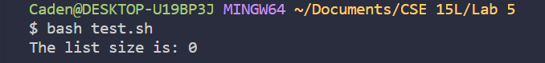
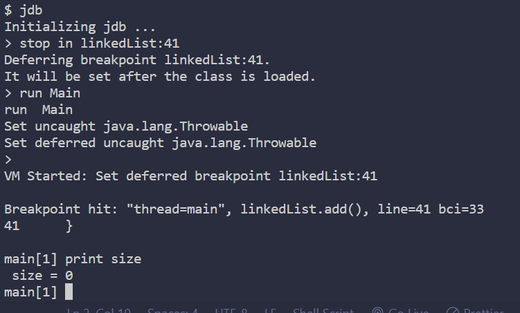

# CSE15L Lab 5

**Part 1 -- Debugging Scenario** <br>
Original post from student: <br>
 <br>
The input is adding a bunch of elements to the LinkedList implementation using the add() method, however, no matter how many elements I add, the size() always returns 0 <br>
The problem if I had to guess is somewhere in the incrementation of the size parameter <br>

TA response: <br>
You can try to run jdb on both the size() method or the add() method and print the corresponding variables(What variable would you print here to see the bug?) <br>

Trying TA's suggestion: <br>
 <br>
I used jdb to stop at the end of the add() method, and by using print in jdb, found out that the size variable is 0 here even after adding. I deduced from this that the bug must be in the add() method, upon closer inspection, the add method lacks the proper code to increment size <br>

All info in the setup: <br>
The file & directory structure needed: <br>
```
Lab 5
  linkedList.java
  test.sh
  StringList.java
  Main.java
```

The contents of each file before fixing the bug: <br>
LinkedList.java: <br>
```
class Node {
  String value;
  Node next;
  public Node(String value, Node next) {
    this.value = value;
    this.next = next;
  }
}

public class linkedList implements StringList {

  Node front;
  int size;

  public linkedList() {
    this.front = new Node(null, null);
  }

  public void prepend(String s) {
    Node newFront = new Node(s, this.front.next);
    this.front.next = newFront;
    this.size += 1;
  }

  public String get(int index) {
    Node current = this.front.next;
    for(int i = 0; i < index; i += 1) {
      current = current.next;
    }
    return current.value;
  }

  public void add(String s) {
    
    Node current = this.front;
    while(current.next != null) {
      current = current.next;
    }
    current.next = new Node(s, null);
  }

  public void remove(int index) {
    Node current = this.front;
    for(int i = 0; i < index; i += 1) {
      current = current.next;
    }
    current.next = current.next.next;
	this.size -= 1;
  }


  public int size() {
    return this.size;
  }

}
```
StringList.java: <br>
```
public interface StringList {

  /* Add an element at the beginning of the list */
  void prepend(String s);

  /* Add an element at the end of the list */
  void add(String s);

  /* Get the element at the given index */
  String get(int index);

  /* Get the number of elements in the list */
  int size();

  /* Add an element at the specified index */
  //void insert(int index, String s);

  /* Remove the element at the specified index */
  //void remove(int index);

}
```
test.sh: <br>
```
javac -g *.java
java Main
```
Main.java: <br>
```
public class Main {
    public static void main(String[] args) {
        linkedList linked = new linkedList();
        linked.add("lettuce");
        linked.add("coconut");
        linked.add("potato");
        System.out.println("The list size is: " + linked.size());
    }

}

```

The full command line (or lines) you ran to trigger the bug: <br>
```
bash<space>test.sh<enter>
```

A description of what to edit to fix the bug: <br>
To fix the bug, one would have to implement a way to increment the size variable whenever the add() method is completed, this can be done by adding
```
size += 1;
```
at the end of the add() method.

**Part 2 -- Reflection** <br>
The thing I am very glad that I got from the second half of this quarter in labs was learning more about vim and jdb. <br>
I find myself using both of them in my personal and academic coding tasks, which is saving me time. A specific one to note <br>
would be using vim to change all instances of one word or number, as it helps me speed through making changes. jdb is also very good <br>
in helping me stop at certain points in a file and read all the variable values without having to write "print" everywhere to debug as before. <br>

